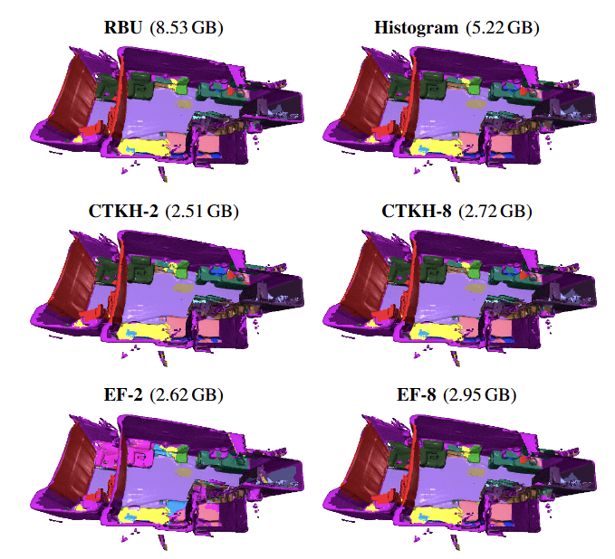

# Memory-Efficient Many-Class 3D Semantic Fusion
This repository contains the implementation of CTKH (Calibrated Top-k Histogram) and EF (Encoded Fusion) semantic fusion techniques introduced in our paper "[Memory-Efficient Real Time Many-Class 3D Metric-Semantic Mapping](https://motion.cs.illinois.edu/papers/IROS2025-Nadgir-CompressedSemanticMapping.pdf)", IROS 2025. 

<p align="center">

</p>

You can find CTKH and EF implementations on lines 610 and 1266 respectively.
(This repository is a fork of [https://github.com/joaomcm/Semantic-3D-Mapping-Uncertainty-Calibration/tree/main](https://github.com/joaomcm/Semantic-3D-Mapping-Uncertainty-Calibration/tree/main).)

Refer to the instructions below to reproduce our experimental results as well as run 3D semantic reconstructions on specific scenes from ScanNet/ScanNet++/BS3D datasets.
## Installation and setup
1. Clone the repo
    ```bash
    git clone --recurse-submodules https://github.com/uiuc-iml/memory-efficient-3d-semantic-mapping.git
    cd memory-efficient-3d-semantic-mapping
    ```
2. Set up environment
    ```bash
    conda create -n semantic_mapping python=3.10.16
    conda activate semantic_mapping
    pip install -r requirements.txt
    ```

3.  Install PyTorch for your CUDA version
    ex:
    ```bash
    pip install torch==1.13.1+cu117 torchvision==0.14.1+cu117 torchaudio==0.13.1  --extra-index-url https://download.pytorch.org/whl/cu117
    ```
    *(Refer to [pytorch.org/get-started/locally/](https://pytorch.org/get-started/locally/).)*

4. Download the dataset of your choice: [ScanNet v2](https://github.com/ScanNet/ScanNet), [ScanNet++](https://kaldir.vc.in.tum.de/scannetpp/), [BS3D](https://etsin.fairdata.fi/dataset/3836511a-29ba-4703-98b6-40e59bb5cd50)

5. Download the pre-trained weights for segmentation models and place them in their respective folders in the /segmentation_model_checkpoints folder.

   ScanNet: Fine-tuned Segformer (https://uofi.app.box.com/s/lnuxvqh77tulivbew7c9y0m6jh5y23ti),
    ESANet (https://uofi.app.box.com/s/hd3mlqcnwh9k1i3f5ffur5kcup32htby).

   ScanNet++: Fine-tuned Segformer ([Download](https://app.box.com/s/njxthbqf76s5wgv314zsovrhi6lce627)) 

   For BS3D, we use the 150 class off-the-shelf segformer-b4-finetuned-ade-512-512 model.
   

6. We provide weights for the encoder-decoder architecture used in EF for encoding dimensions 2,4, and 8 for the below listed segmentation models. To use Encoded Fusion (EF), download the weights and place them in the respective directory under [calibration_experiments/EF_weights/](calibration_experiments/EF_weights/README.md): 

| Model | num_classes | encoding dim = 2 | encoding dim = 4 | encoding dim = 8 |
|-------|-------------|------------------|------------------|------------------|
| ESANet (ScanNet) | 21 | [Download](https://app.box.com/s/66nilpl5utwaobep51jo4wml4d25wymu) | [Download](https://app.box.com/s/h4pp4gt39cj6ubamoq86ktcvwnyc9oh3) | [Download](https://app.box.com/s/d2jvevniulb2n6ofu7m3hutgemhfufrn) |
| Segformer (ScanNet) | 21 | [Download](https://app.box.com/s/mtjkld3wpo0sc2z5eo509zvvc94du2sy) | [Download](https://app.box.com/s/6ild1xo83psfnrhwapeew509oos870ji) | [Download](https://app.box.com/s/hljdtjl3o7df24w4imlx1jhvgur3ihy5) |
| Segformer (ScanNet++) | 101 | [Download](https://app.box.com/s/6lhsklh49f26sg561jqvjn24raugzc0k) | [Download](https://app.box.com/s/umjus3fzjfr5keouemhsaciee4v1d1z6) | [Download](https://app.box.com/s/re5tcq9zgd5sful07u8v1g1v4blqkwdz) |
| Segformer (BS3D) | 150 | [Download](https://app.box.com/s/mevqrsm4j5bch61bdm3rdq1vzr1rdbze) | [Download](https://app.box.com/s/ygre2qustgompxa7hnyecggpe7pjhrim) | [Download](https://app.box.com/s/5mkqeh3a5sdlbivlm9i6vj2d6w4vr56a) |
## Running experiments
1. Specify the paths to dataset, results directory, etc in settings/directory_definitions.json.

2. Run reconstructions for the semantic fusion techniques in settings/experiments_and_short_names.json:
```bash
cd calibration_experiments
python perform_reconstruction.py --dataset "scannet++"
```
Use the argument "scannet" for ScanNet, "scannet++" for ScanNet++, and "bs3d" for BS3D.  
This script will also save per scene memory usage and update times plots in results_dir/{experiment_name}/visuals/.

3. Create the ground truth reconstructions (Only required for ScanNet):
```bash
cd ../dataset_creating_and_finetuning
python create_reconstruction_gts.py
```
Note that only ScanNet and ScanNet++ have ground truth annotations.

4. Run the evaluation script:
```bash
cd ../calibration_experiments
python run_full_eval_scannet.py # or python run_full_eval_scannetpp.py
```
This will output the results in {results_dir}/quant_eval.

## Running semantic reconstructions for specific scenes and semantic fusion technique
1. Example
```bash
python perform_reconstruction.py --dataset "bs3d" --scene "dining" --integration "CTKH" --k 4
```

Note: `--integration` must be one of `["CTKH", "Naive Averaging", "Naive Bayesian", "Histogram", "EF"]`. `k` is valid for CTKH and EF only. 
This will write the point cloud, label file and the plots for VRAM usage and update times in the results_dir you specify in settings/directory_definitions.json.


