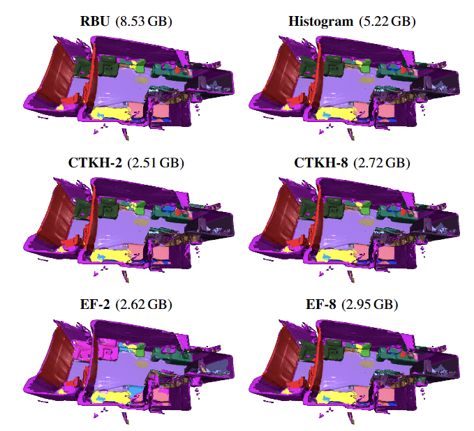

# Memory-Efficient Many-Class 3D Semantic Fusion
This repository contains the implementation of CTKH (Calibrated Top-k Histogram) and EF (Encoded Fusion) semantic fusion techniques introduced in our paper "Memory-Efficient Real Time Many-Class 3D Metric-Semantic Mapping", IROS 2025. 

<p align="center">

</p>

Refer to the instructions below to reproduce our experimental results as well as run 3D semantic reconstructions on specific scenes from ScanNet/ScanNet++/BS3D datasets.
## Installation and setup
1. Clone the repo
    ```bash
    git clone --recurse-submodules https://github.com/uiuc-iml/memory-efficient-3d-semantic-mapping.git
    cd memory-efficient-3d-semantic-mapping
    ```
2. Set up environment
    ```bash
    conda create -n semantic_mapping python=3.10.16
    conda activate semantic_mapping
    pip install -r requirements.txt
    ```

3.  Install PyTorch for your CUDA version
    ex:
    ```bash
    pip install torch==1.13.1+cu117 torchvision==0.14.1+cu117 torchaudio==0.13.1  --extra-index-url https://download.pytorch.org/whl/cu117
    ```
    *(Refer to [pytorch.org/get-started/locally/](https://pytorch.org/get-started/locally/).)*

4. Download the dataset of your choice: [ScanNet v2](https://github.com/ScanNet/ScanNet), [ScanNet++](https://kaldir.vc.in.tum.de/scannetpp/), [BS3D](https://etsin.fairdata.fi/dataset/3836511a-29ba-4703-98b6-40e59bb5cd50)

5. Download the pre-trained weights for:
   ScanNet: Fine-tuned Segformer (https://uofi.app.box.com/s/lnuxvqh77tulivbew7c9y0m6jh5y23ti),
    ESANet (https://uofi.app.box.com/s/hd3mlqcnwh9k1i3f5ffur5kcup32htby).

   ScanNet++: Fine-tuned Segformer TODO(vnadgir) Upload weights to box and add link here.
   Place them in their respective folders in the /segmentation_model_checkpoints folder.

6. To use Encoded Fusion (EF), download the weights and place them in the respective directory under calibration_experiments/EF_weights/: TODO(vnadgir) Upload weights to box and add link here.

## Running experiments
1. Specify the paths to dataset, results directory, etc in settings/directory_definitions.json.

2. Run reconstructions for the semantic fusion techniques in settings/experiments_and_short_names.json:
```bash
cd calibration_experiments
python perform_reconstruction.py --dataset "scannet++"
```
Use the argument "scannet" for ScanNet, "scannet++" for ScanNet++, and "bs3d" for BS3D.
This script will also save per scene memory usage and update times plots in results_dir/{experiment_name}/visuals/.

3. Create the ground truth reconstructions:
```bash
cd ../dataset_creating_and_finetuning
python create_reconstruction_gts.py --dataset "scannet++"
```
Note that only ScanNet and ScanNet++ have ground truth annotations.

4. Run the evaluation script:
```bash
cd ../calibration_experiments
python run_full_eval.py --dataset "scannet++"
```
This will output the results in {results_dir}/quant_eval.
